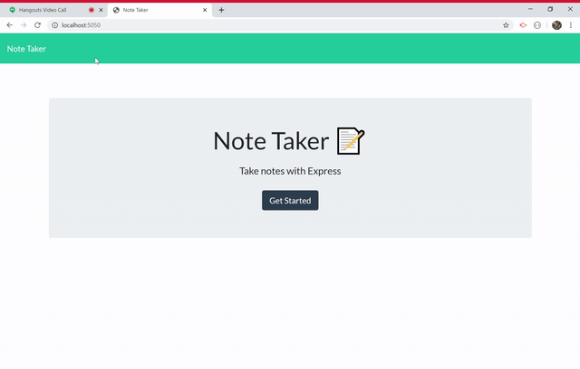

# Note Taker


    
## Description
This application allows users to enter and delete notes. The notes are saved as json data, which is updated as the user takes actions.
    
## Installation
This application requires express.js
```
npm install express
```
    
## Usage 
```
node server.js
```
    
## Credits
The front end of this application was written by Trilogy Education serviecs. I (Ryan Gautier) wrote server.js file

## GIF of Application

